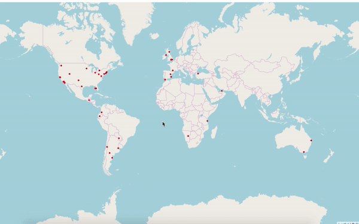

# Tweet Locator

Simple application to locate tweets on a map based on the location from where they were sent.

This application was written in [Python 3.7](https://www.python.org/), and uses [Flask Socket IO](https://flask-socketio.readthedocs.io/en/latest/) which gives Flask applications access to low latency bi-directional communications between the clients and the server, and [Tweepy](https://www.tweepy.org/) a Python-based client to interact with the Twitter REST APIs.

In order to have access to Twitter data programmatically it's necessary to have some access tokens, you can create an app and get your secret tokens from [here](https://developer.twitter.com/en/apps).

## Installation

```
git clone https://github.com/JuanBenitez97/Tweet-Locator.git
cd Tweet-Locator
pip install -r requirements.txt
```

After this proccess is done you need to create a **.env** file to store all your secret tokens and being able to use the Twitter APIs, this file should be in the root folder.
```
CONSUMER_KEY = 'Your API KEY'
CONSUMER_SECRET = 'Your API SECRET KEY'
ACCESS_TOKEN = 'Your Access Token'
ACCESS_SECRET = 'Your Access Secret Token'
```

## Run

```
python app.py
```

If everything is correct you will see the server is running and which host and port is running on.
Just go to the url and wait for the tweets appear on the map.

If you want to filter tweets based on other words you can change the tags in the **app.py** file
```
if __name__ == '__main__':
    """
    tags = ["#python", "programming", "flask"]   
    """
```



**Enjoy it!!**
